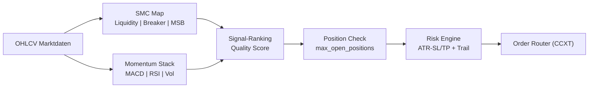

# ⚡ TitanBot - High-Performance Trading System

<div align="center">


[](https://www.python.org/)
[](https://github.com/ccxt/ccxt)
[](LICENSE)

**Ein leistungsstarker Trading-Bot mit SMC-Momentum-Hybrid, dynamischem Stop-Loss und intelligenter Multi-Position-Verwaltung**

[Features](#-features) • [Installation](#-installation) • [Konfiguration](#-konfiguration) • [Live-Trading](#-live-trading) • [Pipeline](#-interaktives-pipeline-script) • [Monitoring](#-monitoring--status) • [Wartung](#-wartung)

</div>

---

## 📊 Übersicht

TitanBot ist ein hochentwickelter Trading-Bot mit Fokus auf Performance und Risikokontrolle. Das System kombiniert Smart Money Concepts (Liquidity Sweeps, Breaker-Blocks) mit Momentum-Indikatoren und verfügt über dynamische Stop-Loss-Mechanismen sowie intelligente Multi-Position-Verwaltung.

### 🧭 Trading-Logik (Kurzfassung)
- **SMC-Momentum-Hybrid**: Nutzt Liquidity Sweeps/Structure Breaks (SMC) kombiniert mit Momentum-Indikatoren (MACD/RSI)
- **Dynamischer Stop-Loss**: SL-Level passen sich an Volatilität/ATR an; optionaler Trailing-SL folgt dem Trend
- **Position-Limit**: `max_open_positions` begrenzt parallele Trades, priorisiert höchste Signal-Qualität
- **Signal-Ranking**: Mehrere Signale werden ranked und best-performing Setups werden bevorzugt
- **Risk Layer**: ATR-basierte SL/TP Berechnung; Positionsgröße auf Konto-Risk begrenzt
- **Execution**: CCXT-Orders mit realistischer Fee/Slippage-Annahmen
- **Telegram-Notifications**: Real-time Updates für alle Position-State-Änderungen

### 🔍 Strategie-Visualisierung


### 📈 Trade-Beispiel (Entry/SL/TP)
- **Setup**: Liquidity Sweep unter Struktur-Low + Momentum-Reversal (MACD Cross Up, RSI aus Oversold)
- **Entry**: Long nach Bestätigungskerze über Breaker-Block mit Signal-Quality-Score > Schwelle
- **Initial SL**: Unter Sweep-Low oder ATR-basiert (1.5–2× ATR)
- **TP**: 2–3× SL-Distanz oder nächstes markantes High/Imbalance-Fill
- **Trailing**: Aktiv nach +1×SL Distanz; Trail unter das letzte Higher Low

---

## 🚀 Features

### Trading Features
- ✅ Smart Money Concepts Implementierung
- ✅ Dynamischer Stop-Loss (anpassbar an Volatilität)
- ✅ Maximale offene Positionen: Konfigurierbar (Standard: 3)
- ✅ Multi-Asset Trading (BTC, ETH, SOL, XRP, AAVE)
- ✅ Multiple Timeframes (5m, 2h, 4h, 6h)
- ✅ Signal-Ranking für höchste Qualität
- ✅ Optionaler MACD-Filter
- ✅ Intelligentes Position Sizing
- ✅ Telegram-Benachrichtigungen

### Technical Features
- ✅ CCXT Integration für mehrere Börsen
- ✅ Optuna Hyperparameter-Optimierung
- ✅ Fortgeschrittene technische Indikatoren
- ✅ Volume-basierte Analysen
- ✅ Backtesting mit realistischer Simulation
- ✅ Walk-Forward-Testing
- ✅ Performance-Tracking und Reporting

---

## 📋 Systemanforderungen

### Hardware
- **CPU**: Multi-Core Prozessor (i5 oder besser empfohlen)
- **RAM**: Minimum 4GB, empfohlen 8GB+
- **Speicher**: 2GB freier Speicherplatz

### Software
- **OS**: Linux (Ubuntu 20.04+), macOS, Windows 10/11
- **Python**: Version 3.8 oder höher
- **Git**: Für Repository-Verwaltung

---

## 💻 Installation

### 1. Repository klonen

```bash
git clone https://github.com/Youra82/titanbot.git
cd titanbot
```

### 2. Automatische Installation (empfohlen)

```bash
# Linux/macOS
chmod +x install.sh
./install.sh

# Windows (PowerShell)
python -m venv .venv
.venv\Scripts\activate
pip install -r requirements.txt
```

Das Installations-Script führt folgende Schritte aus:
- ✅ Erstellt eine virtuelle Python-Umgebung (`.venv`)
- ✅ Installiert alle erforderlichen Abhängigkeiten
- ✅ Erstellt notwendige Verzeichnisse (`data/`, `logs/`, `artifacts/`)
- ✅ Initialisiert Konfigurationsdateien

### 3. API-Credentials konfigurieren

Erstelle eine `secret.json` Datei:

```json
{
  "titanbot": [
    {
      "name": "Binance Trading Account",
      "exchange": "binance",
      "apiKey": "DEIN_API_KEY",
      "secret": "DEIN_SECRET_KEY",
      "options": {
        "defaultType": "future"
      }
    }
  ]
}
```

⚠️ **Wichtig**: 
- Niemals `secret.json` committen oder teilen!
- Verwende nur API-Keys mit eingeschränkten Rechten
- Aktiviere IP-Whitelist auf der Exchange

### 4. Trading-Strategien konfigurieren

Bearbeite `settings.json`:

```json
{
  "live_trading_settings": {
    "max_open_positions": 3,
    "active_strategies": [
      {
        "symbol": "BTC/USDT:USDT",
        "timeframe": "4h",
        "use_momentum_filter": true,
        "use_trailing_stop": true,
        "active": true
      },
      {
        "symbol": "ETH/USDT:USDT",
        "timeframe": "2h",
        "use_momentum_filter": true,
        "use_trailing_stop": true,
        "active": true
      }
    ]
  }
}
```

**Parameter-Erklärung**:
- `max_open_positions`: Max. gleichzeitig offene Positionen
- `symbol`: Handelspaar
- `timeframe`: Zeitrahmen
- `use_momentum_filter`: Momentum-Filter aktivieren
- `use_trailing_stop`: Trailing Stop aktivieren
- `active`: Strategie aktiv

---

## 🔴 Live Trading

### Start des Live-Trading

```bash
# Master Runner starten
cd /home/ubuntu/titanbot && .venv/bin/python3 master_runner.py
```

### Manuell starten / Cronjob testen

```bash
cd /home/ubuntu/titanbot && .venv/bin/python3 master_runner.py
```

Der Master Runner:
- ✅ Lädt Konfigurationen aus `settings.json`
- ✅ Verwaltet offene Positionen (max_open_positions)
- ✅ Startet separate Prozesse für aktive Strategien
- ✅ Berechnet SMC-Signale und Momentum-Scores
- ✅ Überwacht Kontostand und verfügbares Kapital
- ✅ Aktualisiert dynamische Stop-Loss-Level
- ✅ Loggt alle Trading-Aktivitäten
- ✅ Sendet Telegram-Benachrichtigungen

### Automatischer Start (Produktions-Setup)

```bash
crontab -e
```

```
# Starte den TitanBot Master-Runner alle 15 Minuten
*/15 * * * * /usr/bin/flock -n /home/ubuntu/titanbot/titanbot.lock /bin/sh -c "cd /home/ubuntu/titanbot && .venv/bin/python3 master_runner.py >> /home/ubuntu/titanbot/logs/cron.log 2>&1"
```

Logverzeichnis:

```bash
mkdir -p /home/ubuntu/titanbot/logs
```


---

## 📊 Interaktives Pipeline-Script

Das **`run_pipeline.sh`** Script automatisiert die Parameter-Optimierung. Es optimiert SMC-Parameter, Momentum-Indikatoren und Position-Management-Einstellungen.

### Features des Pipeline-Scripts

✅ **Interaktive Eingabe** - Einfache Menü-Navigation  
✅ **Automatische Datumswahl** - Zeitrahmen-basierte Lookback-Berechnung  
✅ **Optuna-Optimierung** - Bayessche Hyperparameter-Suche  
✅ **Batch-Optimierung** - Mehrere Symbol/Timeframe-Kombinationen  
✅ **Automatisches Speichern** - Optimale Konfigurationen  
✅ **Integrierte Backtests** - Sofort nach Optimierung testen  

### Verwendung

```bash
chmod +x run_pipeline.sh
./run_pipeline.sh
```

### Optimierte Konfigurationen

```
artifacts/optimal_configs/
├── optimal_BTCUSDT_4h.json
└── ...
```

**Beispiel-Konfiguration**:

```json
{
  "symbol": "BTCUSDT",
  "timeframe": "4h",
  "parameters": {
    "atr_period": 14,
    "atr_multiplier_sl": 1.8,
    "atr_multiplier_tp": 3.0,
    "macd_fast": 12,
    "macd_slow": 26,
    "rsi_period": 14,
    "momentum_threshold": 0.65,
    "signal_quality_threshold": 0.70
  },
  "performance": {
    "total_return": 11.25,
    "win_rate": 61.5,
    "num_trades": 13,
    "max_drawdown": -6.80,
    "end_capital": 812.50
  }
}
```

## 🔄 Auto-Optimizer Verwaltung
Der Bot verfügt über einen automatischen Optimizer, der wöchentlich die besten Parameter für alle aktiven Strategien sucht. Die folgenden Befehle helfen beim manuellen Triggern, Debugging und Monitoring des Optimizers (angepasst für `titanbot`).

### Optimizer manuell triggern
Um eine sofortige Optimierung zu starten (ignoriert das Zeitintervall):

```bash
# Letzten Optimierungszeitpunkt löschen (erzwingt Neustart)
rm ~/titanbot/data/cache/.last_optimization_run

# Master Runner starten (prüft ob Optimierung fällig ist)
cd ~/titanbot && .venv/bin/python3 master_runner.py
```

### Optimizer-Logs überwachen
```bash
# Optimizer-Log live mitverfolgen
tail -f ~/titanbot/logs/optimizer_output.log

# Letzte 50 Zeilen des Optimizer-Logs anzeigen
tail -50 ~/titanbot/logs/optimizer_output.log
```

### Optimierungsergebnisse ansehen
```bash
# Beste gefundene Parameter anzeigen (erste 50 Zeilen)
cat ~/titanbot/artifacts/results/optimization_results.json | head -50
```

### Optimizer-Prozess überwachen
```bash
# Prüfen ob Optimizer gerade läuft (aktualisiert jede Sekunde)
watch -n 1 "ps aux | grep optimizer"
```

### Optimizer stoppen
```bash
# Alle Optimizer-Prozesse auf einmal stoppen
pkill -f "auto_optimizer_scheduler" ; pkill -f "run_pipeline_automated" ; pkill -f "optimizer.py"

# Prüfen ob alles gestoppt ist
pgrep -fa "optimizer" && echo "Noch aktiv!" || echo "Alle gestoppt."

# In-Progress-Marker aufräumen (sauberer Neustart danach)
rm -f ~/titanbot/data/cache/.optimization_in_progress ~/titanbot/data/cache/.optimization_start_notified
```

---

## 📊 Monitoring & Status

### Status-Dashboard

```bash
./show_status.sh
```

### Live-Position Tracking

```bash
./show_results.sh
```

### Log-Files

```bash
tail -f logs/cron.log
tail -f logs/error.log
tail -n 100 logs/titanbot_BTCUSDTUSDT_4h.log
```


---

## 🛠️ Wartung & Pflege

### Logs ansehen

```bash
tail -f logs/cron.log
tail -n 200 logs/cron.log
grep -i "ERROR" logs/cron.log
grep -i "POSITION" logs/cron.log
```

### Bot aktualisieren

```bash
chmod +x update.sh
bash ./update.sh
```

### 🔧 Config-Management

#### Konfigurationsdateien löschen

Bei Bedarf können alle generierten Konfigurationen gelöscht werden:

```bash
rm -f src/titanbot/strategy/configs/config_*.json
```

#### Löschung verifizieren

```bash
ls -la src/titanbot/strategy/configs/config_*.json 2>&1 || echo "✅ Alle Konfigurationsdateien wurden gelöscht"
```


### Tests ausführen

```bash
./run_tests.sh
pytest tests/test_strategy.py -v
pytest tests/test_smc_detector.py -v
pytest --cov=src tests/
```

---

## 📂 Projekt-Struktur

```
titanbot/
├── src/
│   └── titanbot/
│       ├── strategy/          # Trading-Logik
│       │   ├── run.py
│       │   ├── smc_detector.py
│       │   └── momentum_scorer.py
│       ├── backtest/          # Backtesting
│       │   └── backtester.py
│       └── utils/             # Hilfsfunktionen
│           ├── exchange.py
│           ├── telegram.py
│           └── position_manager.py
├── scripts/
├── tests/
├── data/
├── logs/
├── artifacts/
├── master_runner.py
├── settings.json
├── secret.json
└── requirements.txt
```

---

## ⚠️ Wichtige Hinweise

### Risiko-Disclaimer

⚠️ **Trading mit Kryptowährungen birgt erhebliche Risiken!**

- Nur Kapital einsetzen, dessen Verlust Sie verkraften können
- Keine Garantie für Gewinne
- Vergangene Performance ist kein Indikator
- Testen Sie mit Demo-Accounts
- Starten Sie mit kleinen Beträgen
- Multi-Position-Management erhöht Risiko - `max_open_positions` entsprechend setzen

### Security Best Practices

- 🔐 Keine API-Keys mit Withdrawal-Rechten
- 🔐 IP-Whitelist aktivieren
- 🔐 2FA verwenden
- 🔐 `secret.json` niemals committen
- 🔐 Regelmäßige Updates durchführen
- 🔐 Position-Manager-Logs überwachen

### Performance-Tipps

- 💡 Starten Sie mit max_open_positions = 1
- 💡 Längere Timeframes für stabilere Signale
- 💡 Monitoren Sie regelmäßig die Position-Performance
- 💡 Parameter regelmäßig optimieren
- 💡 Dynamische SL-Anpassung überwachen
- 💡 Position-Sizing angemessen konfigurieren

---

## 🤝 Support & Community

### Probleme melden

1. Prüfen Sie die Logs
2. Führen Sie Tests aus
3. Öffnen Sie ein Issue

### Updates

```bash
git fetch origin
./update.sh
```

### Hochladen

```bash
git add artifacts/optimal_configs/*.json
git commit -m "Update: Optimierte Parameter"
git push origin main
```

---

## 📜 Lizenz

Dieses Projekt ist lizenziert unter der MIT License.

---

## 🙏 Credits

Entwickelt mit:
- [CCXT](https://github.com/ccxt/ccxt)
- [Optuna](https://optuna.org/)
- [Pandas](https://pandas.pydata.org/)
- [TA-Lib](https://github.com/mrjbq7/ta-lib)

---

<div align="center">

**Made with ❤️ by the TitanBot Team**

⭐ Star uns auf GitHub wenn dir dieses Projekt gefällt!

[🔝 Nach oben](#-titanbot---high-performance-trading-system)

</div>
