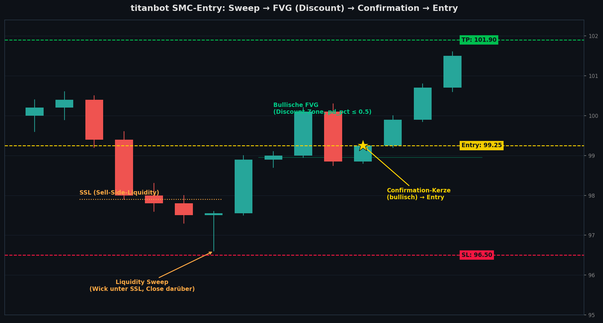
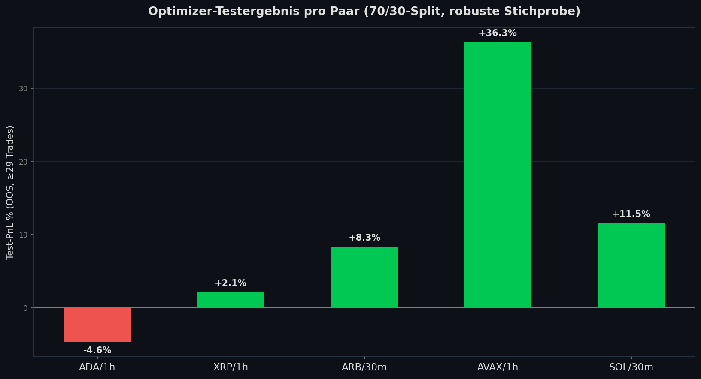

# ⚡ TitanBot - High-Performance Trading System

<div align="center">


[](https://www.python.org/)
[](https://github.com/ccxt/ccxt)
[](LICENSE)

**Ein Trading-Bot auf Basis von Smart Money Concepts (SMC), mit dynamischem Stop-Loss und intelligenter Multi-Position-Verwaltung**

[Features](#-features) • [Installation](#-installation) • [Konfiguration](#-konfiguration) • [Live-Trading](#-live-trading) • [Pipeline](#-interaktives-pipeline-script) • [Screening](#-coin-screening-screen_candidatespy) • [Analyse](#-analyse-script-run_analysissh) • [Monitoring](#-monitoring--status) • [Wartung](#-wartung)

</div>

---

## 📊 Übersicht

TitanBot ist ein Trading-Bot auf Basis von Smart Money Concepts (SMC): Liquidity Sweeps, Order Blocks und Fair Value Gaps bilden den Signal-Kern, ergänzt um dynamische ATR-/Struktur-basierte Stop-Loss-Mechanismen und Multi-Position-Verwaltung.

### 🧭 Trading-Logik (Kurzfassung)
- **SMC-Kern**: Liquidity Sweep (Stop-Hunt) → Rücklauf in unmitigierte FVG/Order-Block in der Premium/Discount-Zone → Confirmation-Kerze → Entry
- **Momentum-Filter (optional, standardmäßig AUS)**: MACD-Cross + RSI-Reversal als zusätzliches Gate (`use_momentum_filter` in der Strategie-Config) — reduziert die Trade-Anzahl stark, siehe `src/titanbot/strategy/momentum_indicators.py`
- **Dynamischer Stop-Loss**: SL-Level passen sich an Volatilität/ATR an; optionaler Trailing-SL folgt dem Trend
- **Position-Limit**: `max_open_positions` begrenzt parallele Trades über alle Strategien
- **Risk Layer**: ATR- oder struktur-basierte SL/TP-Berechnung; Positionsgröße auf Konto-Risk begrenzt
- **Execution**: CCXT-Orders mit realistischer Fee/Slippage-Annahme im Backtest
- **Telegram-Notifications**: Real-time Updates für alle Position-State-Änderungen

### 🔍 SMC-Entry im Detail



Der Bot sagt die Richtung nicht vorher, sondern wartet auf eine bereits erfolgte Bewegung: erst der Sweep (Liquidität wird genommen), dann der Rücklauf in eine noch unangetastete Zone, dann die Bestätigung durch die nächste Kerze. Erst wenn alle drei zusammenkommen, wird eine Position eröffnet.

---

## 🚀 Features

### Trading Features
- ✅ Smart Money Concepts Implementierung
- ✅ Dynamischer Stop-Loss (anpassbar an Volatilität)
- ✅ Maximale offene Positionen: Konfigurierbar (Standard: 3)
- ✅ Multi-Asset Trading (BTC, ETH, SOL, XRP, AAVE)
- ✅ Multiple Timeframes (5m, 2h, 4h, 6h)
- ✅ Signal-Ranking für höchste Qualität
- ✅ Optionaler MACD-Filter
- ✅ Intelligentes Position Sizing
- ✅ Telegram-Benachrichtigungen

### Technical Features
- ✅ CCXT Integration für mehrere Börsen
- ✅ Optuna Hyperparameter-Optimierung
- ✅ Fortgeschrittene technische Indikatoren
- ✅ Volume-basierte Analysen
- ✅ Backtesting mit realistischer Simulation
- ✅ Walk-Forward-Testing
- ✅ Performance-Tracking und Reporting

---

## 📋 Systemanforderungen

### Hardware
- **CPU**: Multi-Core Prozessor (i5 oder besser empfohlen)
- **RAM**: Minimum 4GB, empfohlen 8GB+
- **Speicher**: 2GB freier Speicherplatz

### Software
- **OS**: Linux (Ubuntu 20.04+), macOS, Windows 10/11
- **Python**: Version 3.8 oder höher
- **Git**: Für Repository-Verwaltung

---

## 💻 Installation

### 1. Repository klonen

```bash
git clone https://github.com/Youra82/titanbot.git
cd titanbot
```

### 2. Automatische Installation (empfohlen)

```bash
# Linux/macOS
chmod +x install.sh
./install.sh

# Windows (PowerShell)
python -m venv .venv
.venv\Scripts\activate
pip install -r requirements.txt
```

Das Installations-Script führt folgende Schritte aus:
- ✅ Erstellt eine virtuelle Python-Umgebung (`.venv`)
- ✅ Installiert alle erforderlichen Abhängigkeiten
- ✅ Erstellt notwendige Verzeichnisse (`data/`, `logs/`, `artifacts/`)
- ✅ Initialisiert Konfigurationsdateien

### 3. API-Credentials konfigurieren

Erstelle eine `secret.json` Datei:

```json
{
  "titanbot": [
    {
      "name": "Binance Trading Account",
      "exchange": "binance",
      "apiKey": "DEIN_API_KEY",
      "secret": "DEIN_SECRET_KEY",
      "options": {
        "defaultType": "future"
      }
    }
  ]
}
```

⚠️ **Wichtig**: 
- Niemals `secret.json` committen oder teilen!
- Verwende nur API-Keys mit eingeschränkten Rechten
- Aktiviere IP-Whitelist auf der Exchange

### 4. Trading-Strategien konfigurieren

Bearbeite `settings.json`:

```json
{
  "live_trading_settings": {
    "max_open_positions": 3,
    "active_strategies": [
      {
        "symbol": "BTC/USDT:USDT",
        "timeframe": "4h",
        "use_momentum_filter": true,
        "use_trailing_stop": true,
        "active": true
      },
      {
        "symbol": "ETH/USDT:USDT",
        "timeframe": "2h",
        "use_momentum_filter": true,
        "use_trailing_stop": true,
        "active": true
      }
    ]
  }
}
```

**Parameter-Erklärung**:
- `max_open_positions`: Max. gleichzeitig offene Positionen
- `symbol`: Handelspaar
- `timeframe`: Zeitrahmen
- `use_momentum_filter`: Momentum-Filter aktivieren
- `use_trailing_stop`: Trailing Stop aktivieren
- `active`: Strategie aktiv

---

## 🔴 Live Trading

### Start des Live-Trading

```bash
# Master Runner starten
cd /home/ubuntu/titanbot && .venv/bin/python3 master_runner.py
```

### Manuell starten / Cronjob testen

```bash
cd /home/ubuntu/titanbot && .venv/bin/python3 master_runner.py
```

Der Master Runner:
- ✅ Lädt Konfigurationen aus `settings.json`
- ✅ Verwaltet offene Positionen (max_open_positions)
- ✅ Startet separate Prozesse für aktive Strategien
- ✅ Berechnet SMC-Signale und Momentum-Scores
- ✅ Überwacht Kontostand und verfügbares Kapital
- ✅ Aktualisiert dynamische Stop-Loss-Level
- ✅ Loggt alle Trading-Aktivitäten
- ✅ Sendet Telegram-Benachrichtigungen

### Automatischer Start (Produktions-Setup)

```bash
crontab -e
```

```
# Starte den TitanBot Master-Runner alle 15 Minuten
*/15 * * * * /usr/bin/flock -n /home/ubuntu/titanbot/titanbot.lock /bin/sh -c "cd /home/ubuntu/titanbot && .venv/bin/python3 master_runner.py >> /home/ubuntu/titanbot/logs/cron.log 2>&1"
```

Logverzeichnis:

```bash
mkdir -p /home/ubuntu/titanbot/logs
```


---

## 📊 Interaktives Pipeline-Script

Das **`run_pipeline.sh`** Script automatisiert die Parameter-Optimierung. Es optimiert SMC-Parameter, Momentum-Indikatoren und Position-Management-Einstellungen.

### Features des Pipeline-Scripts

✅ **Interaktive Eingabe** - Einfache Menü-Navigation  
✅ **Automatische Datumswahl** - Zeitrahmen-basierte Lookback-Berechnung  
✅ **Optuna-Optimierung** - Bayessche Hyperparameter-Suche  
✅ **Batch-Optimierung** - Mehrere Symbol/Timeframe-Kombinationen  
✅ **Automatisches Speichern** - Optimale Konfigurationen  
✅ **Integrierte Backtests** - Sofort nach Optimierung testen  

### Verwendung

```bash
chmod +x run_pipeline.sh
./run_pipeline.sh
```

### Optimierte Konfigurationen

```
artifacts/optimal_configs/
├── optimal_BTCUSDT_4h.json
└── ...
```

**Beispiel-Konfiguration**:

```json
{
  "symbol": "BTCUSDT",
  "timeframe": "4h",
  "parameters": {
    "atr_period": 14,
    "atr_multiplier_sl": 1.8,
    "atr_multiplier_tp": 3.0,
    "macd_fast": 12,
    "macd_slow": 26,
    "rsi_period": 14,
    "momentum_threshold": 0.65,
    "signal_quality_threshold": 0.70
  },
  "performance": {
    "total_return": 11.25,
    "win_rate": 61.5,
    "num_trades": 13,
    "max_drawdown": -6.80,
    "end_capital": 812.50
  }
}
```


## 🔍 Coin-Screening: `screen_candidates.py`

`run_pipeline.sh` optimiert gründlich (150-350 Optuna-Trials), aber genau
deshalb ist es zu teuer, um es auf hunderte Coins gleichzeitig loszulassen.
`screen_candidates.py` schließt diese Lücke: ein schneller, breiter Vorab-Scan
über die liquidesten Bitget-USDT-Perpetuals, der den ECHTEN Optimierungs-/
Bewertungscode nutzt (inkl. Leak-freiem 70/30-Scoring, Trailing-Stop, etc.),
nur mit stark reduzierten Trials und kürzerem Zeitraum — Minuten/Coin statt
Stunden.

### Verwendung

```bash
# Standardlauf: Top 100 liquideste Coins, 40 Trials/Kombination, alle Timeframes
.venv/bin/python3 screen_candidates.py

# Kleinerer/schnellerer Scan (z.B. wenn nur 1 Stunde Zeit ist)
.venv/bin/python3 screen_candidates.py --top-n 30 --trials 40 --jobs 6 --timeframes "30m 1h 2h"

# Unterbrochenen Lauf fortsetzen (überspringt bereits gescreente Coins laut CSV)
.venv/bin/python3 screen_candidates.py --resume
```

**Parameter**:
- `--top-n` — Anzahl liquidester Symbole nach 24h-Volumen (Standard: 100)
- `--trials` — Optuna-Trials pro Symbol/Timeframe-Kombination (Standard: 40 — bewusst grob, nur zur Vorselektion)
- `--timeframes` — getestete Timeframes, Leerzeichen-getrennt (Standard: alle 5 — weniger = mehr Coins im gleichen Zeitbudget)
- `--jobs` — Optuna-interne Parallelität pro Symbol-Lauf (Standard: 2)
- `--lookback-weeks` — Backtest-Zeitraum in Wochen, intern 70/30 gesplittet (Standard: 12)
- `--resume` — bereits gescreente Symbole laut CSV überspringen

**Isolation von der Produktion**: läuft komplett getrennt von `run_pipeline.sh`
— nutzt `--config_suffix "_screen"` (landet nie im Config-Glob von
`run_portfolio_optimizer.py`) und eine eigene `--results_file`
(überschreibt nicht die echte `artifacts/results/last_optimizer_run.json`).
Generierte `*_screen.json`-Configs werden nach jedem Coin wieder gelöscht —
das Ergebnis steht bereits in der CSV.

**Ergebnis**: `artifacts/results/screen_candidates.csv`, nach jedem Coin
inkrementell geschrieben (ein Abbruch verliert nichts) — Spalten `symbol`,
`timeframe`, `confirmed`, `test_pnl`, `train_pnl`, `test_trades`, `status`.
Am Ende druckt das Script eine nach Test-PnL sortierte Rangliste der
bestätigten Kandidaten für die volle Pipeline.

> ⚠️ Ein Screening-Treffer ist eine erste Vorselektion, kein Beweis — jeder
> vielversprechende Kandidat sollte danach durch die volle Pipeline
> (`run_pipeline.sh`) und einen echten Walk-Forward-Test
> (`run_analysis.sh` → 1) laufen, bevor er live geht.

---

## 📈 Analyse-Script: `run_analysis.sh`

Das **`run_analysis.sh`** Script bietet 19 wissenschaftliche Analysen für den titanbot unter einem einzigen Befehl.

### Starten

```bash
chmod +x run_analysis.sh
./run_analysis.sh
./run_analysis.sh --no-telegram    # kein Telegram, nur lokale Ausgabe
```

### Menü-Übersicht

```
=======================================================
  titanbot — Wissenschaftliche Analysen
=======================================================

  ── Priorität 1: Fundament ─────────────────────────
   1) Walk-Forward Lookback-Analyse
   2) Slippage & Fee Impact
   3) Monte Carlo Simulation
   4) Bootstrap Signifikanztest

  ── Priorität 2: Direkte Gewinnoptimierung ──────────
   5) RR-Ratio Optimierung          (Walk-Forward)
   6) ATR Multiplier Sweep          (Walk-Forward)
   7) SMC Window Sweep              (Walk-Forward)
   8) Parameter Sensitivity         (Tornado-Diagramm)

  ── Priorität 3: Systemverbesserung ─────────────────
   9) Regime Performance Analysis
  10) Tageszeit-Analyse
  11) Anti-Korrelations-Portfolio
  12) Kelly Position Sizing

  ── Priorität 4–6: Feintuning & Portfolio ───────────
  13) SMC Filter Kombinationen
  14) Order Block Qualitäts-Analyse
  15) FVG Hit Rate Analyse
  16) Volatilitäts-Filter Optimierung
  17) Multi-Timeframe Confirmation Impact
  18) Drawdown Duration Analysis
  19) Entry Timing Analyse

   0) Alle Analysen nacheinander ausführen

Auswahl (0-19):
```

### Analysen im Detail

| Nr | Name | Was es zeigt |
|---|---|---|
| 1 | Walk-Forward Lookback | Welcher `backtest_lookback_weeks`-Wert (1–8W) ist am robustesten? |
| 2 | Fee Impact | Ab welcher Gebühr wird der Bot unrentabel? Break-Even-Fee |
| 3 | Monte Carlo | 10.000 Trade-Shuffles → 5./95. Perzentil, Ruin-Risiko |
| 4 | Bootstrap Test | Sind Win-Raten statistisch signifikant > 50% (Zufall)? |
| 5 | RR-Ratio | Optimales Risk:Reward out-of-sample (1.0–4.0) |
| 6 | ATR Multiplier | Optimaler Stop-Loss ATR-Faktor out-of-sample (0.5–3.0) |
| 7 | SMC Window | Optimale `swingsLength` out-of-sample (10–50) |
| 8 | Sensitivity | Tornado-Chart: welche Parameter machen das System fragil? |
| 9 | Regime | Win-Rate pro Markt-Regime (TREND_UP/DOWN, RANGE, NEUTRAL) |
| 10 | Tageszeit | Win-Rate pro Session (Asia/Europa/US) und Wochentag |
| 11 | Korrelation | Korrelationsmatrix der Pairs → Portfolio mit min. Drawdown |
| 12 | Kelly Sizing | Optimaler Risk% pro Trade (Full/Half-Kelly vs. Config-Wert) |
| 13 | SMC Filter | Alle 8 Kombinationen der P/D × Sweep × Rejection-Filter |
| 14 | OB Quality | `min_ob_quality` Sweep (0.0–0.5) → Qualität vs. Trade-Anzahl |
| 15 | FVG Size | `min_fvg_size_pct` Sweep (0.02–0.5) → FVG-Filter-Optimum |
| 16 | Vola Filter | ADX-Filter ON/OFF + Schwellwert-Sweep (15–35) |
| 17 | MTF Filter | `use_mtf_filter` True vs. False: Qualität vs. Trade-Anzahl |
| 18 | DD Duration | Wie lange dauern Drawdown-Phasen? Recovery-Zeit |
| 19 | Entry Timing | Stunden-Heatmap (0–23h UTC × Wochentag) |

### Zeitraum-Konfiguration

Alle Analysen nutzen automatisch `backtest_lookback_weeks` und `warmup_weeks` aus `settings.json`:

```json
"optimization_settings": {
    "backtest_lookback_weeks": 2,
    "warmup_weeks": 4
}
```

- **`backtest_lookback_weeks`**: Wie viele Wochen zurück der Backtest geht (rollierende Fenster)
- **`warmup_weeks`**: Extra-Wochen für SMC-Strukturaufbau (Order Blocks, FVGs) — diese Trades zählen nicht in der Statistik

## 🔄 Auto-Optimizer Verwaltung
Der Bot verfügt über einen automatischen Optimizer, der wöchentlich die besten Parameter für alle aktiven Strategien sucht. Die folgenden Befehle helfen beim manuellen Triggern, Debugging und Monitoring des Optimizers (angepasst für `titanbot`).

> Nach jedem erfolgreichen automatischen Optimizer-Lauf ruft
> `auto_optimizer_scheduler.py` automatisch `push_configs.sh` auf, damit
> `settings.json::active_strategies` auf der VPS und im Git-Repo synchron bleiben.

### Optimizer manuell triggern
Um eine sofortige Optimierung zu starten (ignoriert das Zeitintervall):

```bash
# Direkt forcen (empfohlen)
cd ~/titanbot && .venv/bin/python3 auto_optimizer_scheduler.py --force

# Alternativ: Letzten Optimierungszeitpunkt löschen (erzwingt Neustart beim nächsten Master Runner Aufruf)
rm ~/titanbot/data/cache/.last_optimization_run

# Master Runner starten (prüft ob Optimierung fällig ist)
cd ~/titanbot && .venv/bin/python3 master_runner.py
```

### Replot — Charts neu generieren (ohne Re-Optimierung)

Das aktive Portfolio erneut simulieren und Equity-Chart + Trades-Excel via Telegram senden — ohne die komplette Optimierung neu durchzuführen:

```bash
cd ~/titanbot && .venv/bin/python3 run_portfolio_optimizer.py --replot
```

Optionale Parameter (werden sonst aus `settings.json` gelesen):
```bash
.venv/bin/python3 run_portfolio_optimizer.py --replot --capital 200 --start-date 2024-01-01 --end-date 2025-01-01
```

### Optimizer-Logs überwachen
```bash
# Optimizer-Log live mitverfolgen
tail -f ~/titanbot/logs/optimizer_output.log

# Letzte 50 Zeilen des Optimizer-Logs anzeigen
tail -50 ~/titanbot/logs/optimizer_output.log
```

### Optimierungsergebnisse ansehen
```bash
# Beste gefundene Parameter anzeigen (erste 50 Zeilen)
cat ~/titanbot/artifacts/results/optimization_results.json | head -50
```

### Optimizer-Prozess überwachen
```bash
# Prüfen ob Optimizer gerade läuft (aktualisiert jede Sekunde)
watch -n 1 "ps aux | grep optimizer"
```

### Optimizer stoppen
```bash
# Alle Optimizer-Prozesse auf einmal stoppen
pkill -f "auto_optimizer_scheduler" ; pkill -f "run_pipeline_automated" ; pkill -f "optimizer.py"

# Prüfen ob alles gestoppt ist
pgrep -fa "optimizer" && echo "Noch aktiv!" || echo "Alle gestoppt."

# In-Progress-Marker aufräumen (sauberer Neustart danach)
rm -f ~/titanbot/data/cache/.optimization_in_progress ~/titanbot/data/cache/.optimization_start_notified
```

---

## 📊 Chart-Simulation

Generiert SMC-Charts mit allen Zonen (Order Blocks, FVGs, Liquiditätsniveaus) und simulierten Entry/SL/TP-Levels — **ohne echten Trade**. Sendet die Charts direkt per Telegram.

```bash
# Alle aktiven Strategien aus settings.json (LONG-Simulation)
.venv/bin/python show_chart.py

# Nur ein bestimmtes Symbol/Timeframe
.venv/bin/python show_chart.py --symbol LTC/USDT:USDT --timeframe 6h

# Als SHORT simulieren
.venv/bin/python show_chart.py --symbol LTC/USDT:USDT --timeframe 6h --side sell
```

Die simulierten Trade-Levels werden aus dem aktuellen Close-Preis + ATR berechnet — identisch zur Live-Logik.

---

## 📊 Monitoring & Status

### Status-Dashboard

```bash
./show_status.sh
```

### Live-Position Tracking

```bash
./show_results.sh
```

### Log-Files

```bash
tail -f logs/cron.log
tail -f logs/error.log
tail -n 100 logs/titanbot_BTCUSDTUSDT_4h.log
```


---

## 🛠️ Wartung & Pflege

### Logs ansehen

```bash
tail -f logs/cron.log
tail -n 200 logs/cron.log
grep -i "ERROR" logs/cron.log
grep -i "POSITION" logs/cron.log
```

### Bot aktualisieren

```bash
chmod +x update.sh
bash ./update.sh
```

### 🔧 Config-Management

#### Vollständiger Reset & Neuoptimierung (empfohlen)

Wenn sich der Optimizer-Code oder die Trading-Logik grundlegend geändert hat, müssen alle alten Konfigurationen und die Optuna-Datenbank gelöscht werden, bevor eine neue Pipeline gestartet wird:

```bash
# 1. Alles zurücksetzen (Configs + Optuna-DB + Optimizer-History)
./run_pipeline.sh cleanup

# 2. Alten Autopilot-Run löschen (verhindert dass der Bot alte Strategien startet)
rm -f artifacts/results/last_optimizer_run.json

# 3. Neue Optimierung starten
./run_pipeline.sh
```

> ⚠️ Die Optuna-Datenbank (`artifacts/db/optuna_studies_smc.db`) **muss** gelöscht werden wenn sich Parameter-Namen im Code geändert haben — sonst schlägt die Optimierung mit einem `KeyError` fehl.

#### Konfigurationsdateien manuell löschen

```bash
rm -f src/titanbot/strategy/configs/config_*.json
```

#### Löschung verifizieren

```bash
ls -la src/titanbot/strategy/configs/config_*.json 2>&1 || echo "✅ Alle Konfigurationsdateien wurden gelöscht"
```


### Tests ausführen

```bash
./run_tests.sh
pytest tests/test_strategy.py -v
pytest tests/test_smc_detector.py -v
pytest --cov=src tests/
```

---

## 📂 Projekt-Struktur

```
titanbot/
├── src/
│   └── titanbot/
│       ├── strategy/          # Trading-Logik
│       │   ├── run.py
│       │   ├── smc_detector.py
│       │   └── momentum_scorer.py
│       ├── backtest/          # Backtesting
│       │   └── backtester.py
│       └── utils/             # Hilfsfunktionen
│           ├── exchange.py
│           ├── telegram.py
│           └── position_manager.py
├── scripts/
├── tests/
├── data/
├── logs/
├── artifacts/
├── master_runner.py
├── settings.json
├── secret.json
└── requirements.txt
```

---

## ⚠️ Wichtige Hinweise

### Risiko-Disclaimer

⚠️ **Trading mit Kryptowährungen birgt erhebliche Risiken!**

- Nur Kapital einsetzen, dessen Verlust Sie verkraften können
- Keine Garantie für Gewinne
- Vergangene Performance ist kein Indikator
- Testen Sie mit Demo-Accounts
- Starten Sie mit kleinen Beträgen
- Multi-Position-Management erhöht Risiko - `max_open_positions` entsprechend setzen

### Security Best Practices

- 🔐 Keine API-Keys mit Withdrawal-Rechten
- 🔐 IP-Whitelist aktivieren
- 🔐 2FA verwenden
- 🔐 `secret.json` niemals committen
- 🔐 Regelmäßige Updates durchführen
- 🔐 Position-Manager-Logs überwachen

### Performance-Tipps

- 💡 Starten Sie mit max_open_positions = 1
- 💡 Längere Timeframes für stabilere Signale
- 💡 Monitoren Sie regelmäßig die Position-Performance
- 💡 Parameter regelmäßig optimieren
- 💡 Dynamische SL-Anpassung überwachen
- 💡 Position-Sizing angemessen konfigurieren

---

## 🤝 Support & Community

### Probleme melden

1. Prüfen Sie die Logs
2. Führen Sie Tests aus
3. Öffnen Sie ein Issue

### Updates

```bash
git fetch origin
./update.sh
```

### Configs pushen

```bash
chmod +x push_configs.sh
./push_configs.sh
```

Staged automatisch alle Configs + `settings.json`, holt Remote-Stand via Rebase und pusht — ohne manuelle git-Befehle.

#### Merge-Konflikt beim Pushen lösen

Falls `push_configs.sh` mit Rebase-Konflikten abbricht (z.B. weil Configs auf dem Remote gelöscht wurden), die lokalen Configs behalten und durchsetzen:

```bash
git checkout --theirs src/titanbot/strategy/configs/
git add src/titanbot/strategy/configs/
git rebase --continue
git push
```

- `--theirs` übernimmt beim Rebase die lokale (VPS) Version der Configs
- Danach läuft der Rebase durch und der Push funktioniert normal

---

## 📜 Lizenz

Dieses Projekt ist lizenziert unter der MIT License.

---

## Coin & Timeframe Empfehlungen

TitanBot trifft keine feste Coin- oder Timeframe-Bewertung. `run_pipeline.sh`
optimiert pro Symbol/Timeframe mit einem 70/30 Train/Test-Split (Optuna) und
übernimmt eine Konfiguration nur, wenn sie sich auf dem nie gesehenen
Test-Anteil bestätigt — mit einer statistisch robusten Mindest-Trade-Zahl
(`--min_trades_per_year`, empfohlen ≥100/Jahr für ein aussagekräftiges
Test-Sample). Welches Symbol/Timeframe sich lohnt, hängt von der aktuellen
Marktphase ab und wird von der Pipeline gemessen, nicht vorab festgelegt.

Beispielhafte Test-Ergebnisse (70/30-Split, ≥29 Test-Trades im 30%-Fenster,
letztes Jahr):



| Paar | Test-PnL | Test-Trades |
|---|---|---|
| ADA/1h | -4.6% | 29+ |
| XRP/1h | +2.1% | 29+ |
| **ARB/30m** | **+8.3%** | 29+ |
| **AVAX/1h** | **+36.3%** | 29+ |
| SOL/30m | +11.5% | 29+ |

Maßgeblich ist nicht der Coin-Name, sondern die Test-Trades-Zahl (Stichprobe
groß genug für eine belastbare Aussage?) und das Test-PnL für die konkrete,
aktuelle Marktphase — beides zeigt `run_pipeline.sh` pro Lauf direkt an.

---

## 🙏 Credits

Entwickelt mit:
- [CCXT](https://github.com/ccxt/ccxt)
- [Optuna](https://optuna.org/)
- [Pandas](https://pandas.pydata.org/)
- [TA-Lib](https://github.com/mrjbq7/ta-lib)

---

<div align="center">

**Made with ❤️ by the TitanBot Team**

⭐ Star uns auf GitHub wenn dir dieses Projekt gefällt!

[🔝 Nach oben](#-titanbot---high-performance-trading-system)

</div>
